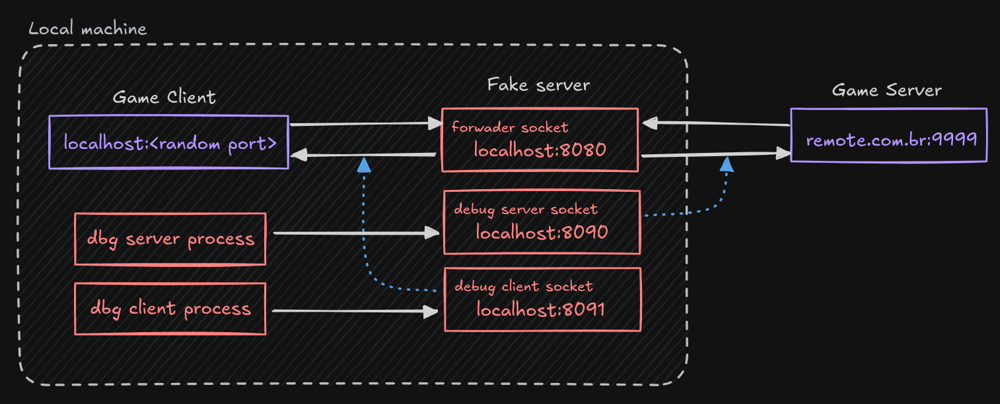

# FakeServer

Servidor falso para monitorar e interagir com comunicação socket TCP.

## Descrição

Este servidor encaminha conexões TCP entre um cliente e um servidor real, permitindo inspecionar e injetar comandos nos fluxos de dados de ambos os lados via sockets de debug.

- **DbgServerAddr**: Permite injetar comandos no socket do servidor (simulando o cliente).
- **DbgClientAddr**: Permite injetar comandos no socket do cliente (simulando o servidor).



## Uso

Compile o servidor:

```sh
go build -o fakeserver main.go
```

Execute o servidor especificando o endereço de escuta e o endereço remoto:

```sh
./fakeserver <listen_address> <remote_address> [-s <dbg_server_address>] [-c <dbg_client_address>]
```

- `<listen_address>`: Endereço e porta para o servidor escutar (ex: `127.0.0.1:9000`)
- `<remote_address>`: Endereço e porta do servidor remoto para encaminhar (ex: `127.0.0.1:5555`)
- `-s <dbg_server_address>`: (Opcional) Endereço para injetar comandos no socket do servidor (padrão: `127.0.0.1:8888`)
- `-c <dbg_client_address>`: (Opcional) Endereço para injetar comandos no socket do cliente (padrão: `127.0.0.1:8889`)

### Exemplo

Encaminhar conexões de `localhost:9000` para `localhost:5555`:

```sh
./fakeserver 127.0.0.1:9000 127.0.0.1:5555
```

Com debug habilitado em portas customizadas:

```sh
./fakeserver 127.0.0.1:9000 127.0.0.1:5555 -s 127.0.0.1:9998 -c 127.0.0.1:9999
```

### Injetando comandos

Para injetar comandos no fluxo do servidor (simulando o cliente):

```sh
nc 127.0.0.1 8888
```

Para injetar comandos no fluxo do cliente (simulando o servidor):

```sh
nc 127.0.0.1 8889
```

O que for enviado por esses sockets será encaminhado para o destino correspondente.

---